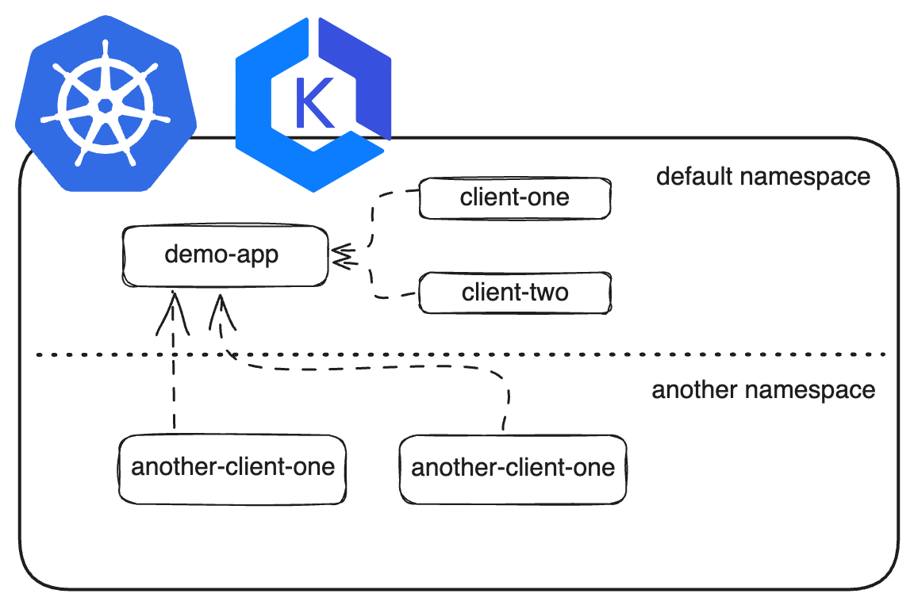

# VPC CNI Network Example

This repository contains example Terraform code and configuration for enabling Network Policies for VPC CNI on Amazon EKS. There is also a bash scripts to configure VPC CNI and another one for cleanup the resources.

Network policies are available within VPC CNI!



## Prerequisites

- A Kubernetes Cluster

- AWS IAM Permissions for creating and attaching IAM Roles

- Installation of required tools:

  - [AWS CLI](https://aws.amazon.com/cli/)

  - [kubectl](https://kubernetes.io/docs/tasks/tools/#kubectl)

  - [Helm](https://helm.sh/docs/intro/install/)

  - [Terraform](https://learn.hashicorp.com/tutorials/terraform/install-cli#install-terraform)

  - [eksctl](https://docs.aws.amazon.com/eks/latest/userguide/eksctl.html)

If you don't have a Kubernetes cluster, you can create an EKS cluster with Terraform using the [example codes](./scripts/) within this repository.

## Terraform Codes

Terraform codes in this repository uses [Amazon EKS Terraform Module](https://github.com/terraform-aws-modules/terraform-aws-eks)

Terraform codes in this repository creates following resources:

- VPC with 6 subnets (3 Private, 3 Public)

- EKS Cluster with Kubernetes version set to 1.27

- EKS Managed Node group

> You can update the Terraform codes according to your requirements and environment.

### Installation of EKS Cluster

```shell
terraform init
terraform plan
terraform apply --auto-approve
```

> PS:
>
> - These resources are not Free Tier eligible.
> - You need to configure AWS Authentication for Terraform with either [Environment Variables](https://docs.aws.amazon.com/cli/latest/userguide/cli-configure-envvars.html#envvars-set) or AWS CLI [named profiles](https://docs.aws.amazon.com/cli/latest/userguide/cli-configure-profiles.html#cli-configure-profiles-create).

You can connect to your cluster using this command:

```bash
aws eks --region <region> update-kubeconfig --name <cluster_name>
```

> You need to change `region` and `cluster_name` parameters.

### Configuration of the VPC CNI

You need to enable the Network Policy for VPC CNI by setting `enableNetworkPolicy` configuration value to `true`.

The configuration [script](./scripts/vpc_cni.sh) has two functions called Permissions and CNI Config.

- Permissions function creates OIDC identity provider for the Kubernetes cluster and creates IAM Roles for for Service Accounts of the Service Controllers.

- CNI Config function updates the Amazon EKS VPC CNI config and add necessary configuration value.

### Network Policy Examples

This repository also contains exeample Kubernetes YAML manifests in the [example-manifest](./example-manifests/) folder to deploy an example application stack. This stack contains these components:

- Two namespaces

- A Demo app deployment in the default namespace and the service for the application

- Two clients in the default namespace

- Two clients in the other namespace

You can deploy the applications with `kubectl apply -f example-manifests/` command from the root directory of this repository.

By default, every pod can connect to other pods in the Kubernetes cluster. You can control the traffic within Kubernetes cluster with network policies and there are different policy example definitions for different scenarios in the [policies](./example-manifests/policies/) directory. You can test these policies one by one by applying the necessary YAML definition with `kubectl apply`.

### Cleanup

You can delete the kubernetes resources you've created with the definitions within this repository, you can run `kubectl delete -f example-manifests/policies/` and `kubectl delete -f example-manifests/` commands.

When you want to delete all the other resources created in this repository, you can run `./cleanup.sh` script in the scripts directory of this repository.

The [script](./scripts/cleanup.sh) has one function and does the following:

- Deletes the OIDC Provider of EKS Cluster

- Deletes the IAM Policy and IAM Role

- Deletes the EKS Cluster created with Terraform
